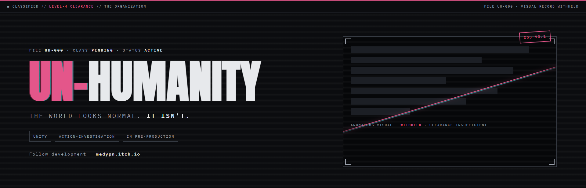

<p align="center">
  
</p>

<h1 align="center">UN-HUMANITY</h1>

<p align="center"><b>The world looks normal. It isn't.</b></p>

<p align="center">
  
  
  
  <a href="https://medypn.itch.io"></a>
</p>

---

## ■ CLASSIFIED // LEVEL-4 CLEARANCE

Since roughly the Bronze Age, reality has been leaking **anomalies** — beings,
objects, and events that don't belong. Most people can't perceive them at all.
You can.

**UN-HUMANITY** is a third-person action-investigation built solo in Unity.
You play a Seer-Operative for a covert organization whose entire job is
keeping the illusion of normal life intact: find the anomaly, decide what it
is, and handle it — then go home and pretend you have a normal job.

## The pillars

| # | Pillar | Meaning |
|---|--------|---------|
| 01 | **Perception is power** | Seeing the anomaly is the first challenge — not just fighting it. |
| 02 | **Normalcy is a resource** | Every mishandled incident cracks the world's sense of normal. Losing it is a slower, stranger fail state than dying. |
| 03 | **Secret duty, personal cost** | Protecting the world means living a double life. Nobody thanks you. Nobody can. |

## The loop

```
TIP → INVESTIGATE → CLASSIFY → ENGAGE → RESOLVE → GO HOME AND ACT NORMAL
```

Not everything you find is hostile. Wrong calls have consequences either way.

## The rule

Human power costs what the craft costs — a writer's power needs believers, a
painter's power needs skill. **Un-Humanity is every power that skips the price.**

## Devlogs

Development is logged in [`/devlogs`](devlogs) and mirrored to
[itch.io](https://medypn.itch.io).

| # | Entry |
|---|-------|
| 000 | [First Disclosure](devlogs/000-first-disclosure.md) |

## Status

Pre-production. GDD v0.1 complete. Current goal: the vertical slice —
**one location, one anomaly, one full loop.**

---

<p align="center">
  <sub>From <b>Momoiro's Workshop</b> · <a href="https://medypn.itch.io">medypn.itch.io</a> · All rights reserved — see <a href="LICENSE.md">LICENSE</a></sub>
</p>
