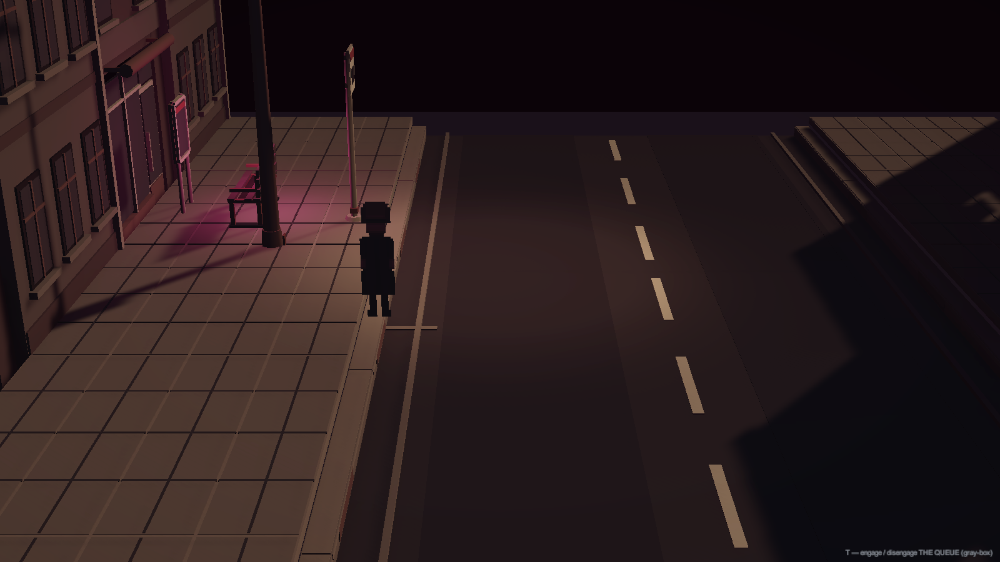
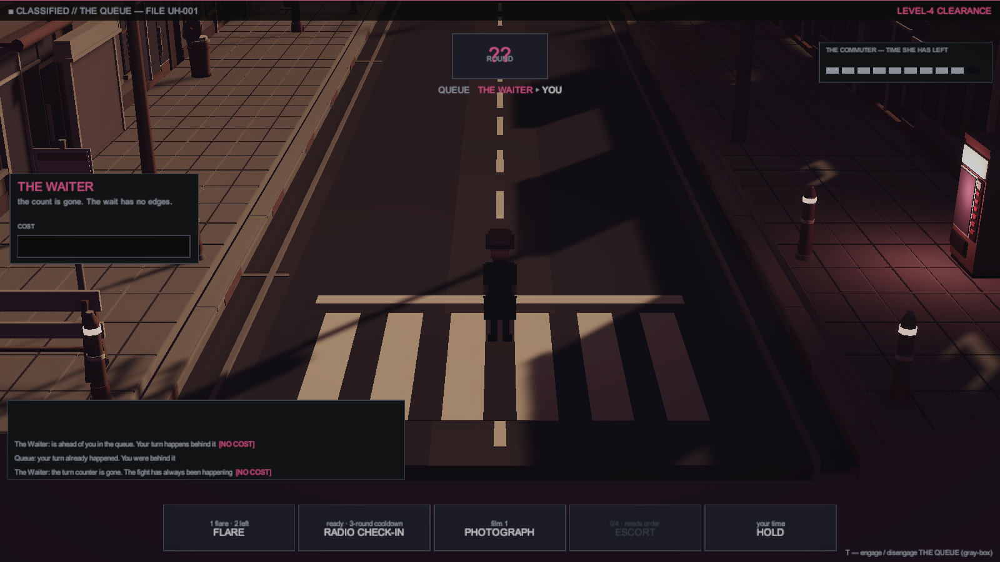

# Devlog 002 — The Fight You Cannot Win by Damage

`FILE UH-000 · DEVLOG 002 · 2026-08-02 · pre-production`

Last entry locked the genre and said the quiet part out loud: these enemies
cheat, and turn-based combat exists so you can *see* them do it. This entry
is proof of build. The first encounter's rules engine is written, tested,
and playable in the gray-box.

## The street exists now

The vertical slice's location — one street block, evening, Route 9
northbound — is up and walkable in Unity. HD-2D as promised: pixel
character in a low-poly street, diorama camera, sodium streetlight pools
on the asphalt. Hold Sight and the world drains to ink and wine, the
lamps go cold and start to stutter, and the far end of the road stops
being empty.

That bus stop is not there when you walk up. It has always been there.

## THE QUEUE, playable

The first fight is against something that will not fight you. It waits.
And it cheats — visibly, in the UI, where you can point at it:

- **It takes your turn.** The queue readout puts you behind it. Your turn
  still happens — behind its silhouette, where it does you no good.
- **It deletes the turn counter.** Mid-fight the round display becomes
  `??`. The fight has always been happening.
- **[WAITING].** A status that says you may act after it acts. It does
  not act.
- **Its cost panel is empty.** Not broken — empty. Every move it makes
  costs nothing, and the interface shows you that nothing, on purpose.

Your side of the fight pays for everything, and the game shows that too:
a flare burns on its own schedule, a radio check-in forces a schedule back
into the world (the counter comes back when dispatch expects you), and
walking the bystander out of the queue costs full turns you have to earn.
There is no damage number anywhere in this fight. You cannot hurt it.
You can only make time hold long enough.

## Receipts

The rules engine is a standalone, engine-independent module with an
automated test suite — twelve tests covering every violation and every
counter. The suite caught a real bug on its first run: the window of
enforced order expired one round too early, which quietly made the fight
unwinnable. That is exactly the class of bug you want caught in week one.

First scripted playthrough of the gray-box encounter: the bystander made
it out **with one round to spare on her clock**. The pacing math holds.

## Next

The investigation layer — the case log, the evidence on the street, and
the moment the game asks you what you think this thing is before you're
anywhere near ready to answer.

---

*Mirrored to [itch.io](https://medypn.itch.io) — follow there for builds.*
