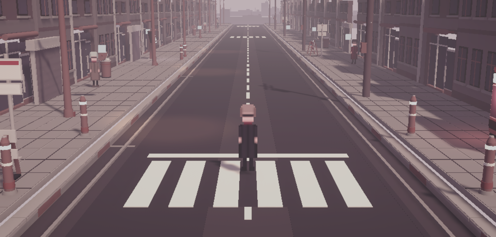

# Devlog 003 — The Loop Closes

`FILE UH-000 · DEVLOG 003 · 2026-08-02 · vertical slice`

Devlog 002 ended with a fight you cannot win by damage. This entry is the
rest of the sentence: the whole loop now runs, start to finish, in one
sitting. Tip → investigate → classify → engage → resolve → go home and
act normal. Every beat is in the build and playable.

## The street moved to morning

One correction to 002: the street is no longer an evening. Normalcy is a
bright, ordinary morning now — commuters down the block, a long open road,
a city that visibly keeps going past where you're allowed to walk.
**Sight is what kills the sun.** Hold it and the morning turns out to have
been a courtesy: near-black, wine-drained, two lamps stuttering, and the
thing at the end of the road that was not there in daylight.

The scare works better this way. Evening was already halfway to horror;
morning gives Sight something to take from you.

## The case file is a verb now

Investigation is in: you walk the block, examine what responds, and the
evidence lands in an actual case file — records, photographs, testimony
that doesn't quite agree with itself. When the file holds enough, it asks
you to do the one thing this game is actually about: **commit to a
reading.** The file accepts exactly one classification. It does not accept
apologies.

What you concluded — and whether you were right — is what decides how the
encounter can end.

## Pixel chrome

The whole interface got rebuilt in a proper pixel identity this week:
chunky solid chips, a real keycap sprite when something wants examining,
and a pixel typeface across every panel from the case file to THE QUEUE.
(Key prompt sprites from Vryell's Controllers & Keyboard pack — worth
every satang.)

## Receipts

- The full six-beat loop runs end to end in the gray-box, verified in
  play mode.
- The combat and case engines now carry **23 automated tests**, all green
  (twelve when 002 shipped).
- Still gray-box on purpose: the art pass — real character sprites and
  the street's texture atlases — is next, along with witness dialogue,
  audio, and the first cold playtest with someone who has never seen any
  of this.

The case closes either way. The question was never whether you can finish
it — it's whether you understood what you finished.

— Momoiro's Workshop
